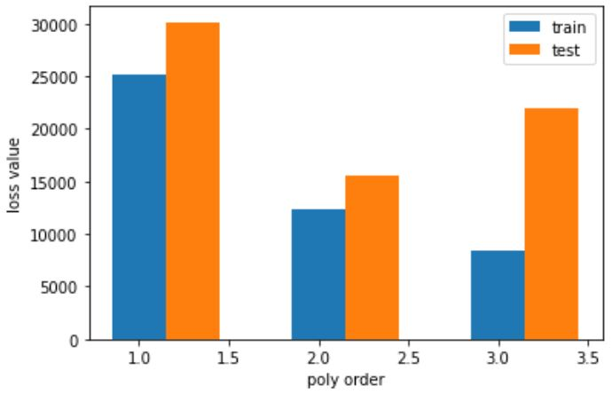
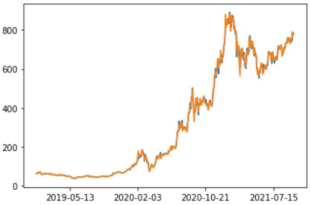
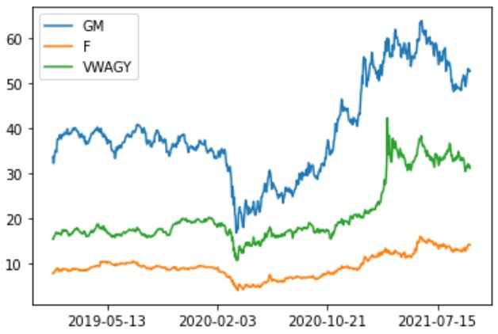

## How we plan to avoid overfitting or underfitting: 


In order to find the best degree in different polynomial transformations, we compared the different performance according to the Mean Square Error (MSE). We used PolynomialFeatures from sklearn to construct the transformations with different exponents. Since the function generates all polynomial and interaction features including all polynomial combinations of the features with degree less than or equal to the given degree, the number of features increases exponentially which means it is easy to cause overfitting. Therefore, we tried 1, 2, 3 as the given degree and compared the loss values. The data were divided into training and testing sets and calculated the MSE separately. 




From the plot, when the degree increases from 1 to 3, the MSE of training sets decreases, while the MSEs of testing sets decrease and then increase which means the model starts to be overfitting when the degree is larger than 2. 


## How we will test the effectiveness of model: 


We currently use mean squared error to assess the loss of the model on predictions. Some plans for improvements on effectiveness tests include using a different loss function, using the model to predict the stock price of Tesla as well as time series and assessing the model performance during special times.


## Data description:


### Competitors Stock Price dataset:
In this dataset, we collect three Tesla’s major competitors (Volkswagen, General Motors and Ford) open and close stock prices from Jan 1, 2019 to Sep 31, 2021. (Data extracted from Yahoo Finance). 
### Tesla Stock Price dataset:
In this dataset, we collect Tesla’s open and close stock prices from Jan 1, 2019 to Sep 31, 2021. (Data extracted from Yahoo Finance)
To get a better understanding of the relationship between each brand, we combined two datasets and utilized two line graphs to show the change of stock price from 2019 to 2021. 







It is noticeable that the trend of General Motors looks more similar to the trend of Tesla, implying that principal component analysis may be conducted in our next step. Additionally, we add stock price difference columns for each brand to get more features to our model. One of the benefits by doing so is that we can easily tell the relationship of stock price for the same brand.  


### Twitter dataset:
It takes a little longer than we thought to extract the data from Twitter API. (to be updated)


## Features and examples that are presented: 
There are 9 features in the model: the date, open and closed prices for Volkswagen, General Motors, Tesla and Ford;
And 693 examples: the number of trade dates from January 2, 2019 to September 30, 2021.


## Data that is missing:
The main datasets that we extracted from the internet are twitter and news dataset. There would be multiple tweets per day, but we only need one post connected to each day. Thus, we decided to pick 20 relative keywords and choose the post that has the most matches with the keyword list. For the latter dataset, relevant news would not be published everyday, thus we will add an one-hot column of Yes/No to show if there is news at that date and choose the data with a Yes.


## How we choose features and transformation: 
We have/plan to have features of types numerical, boolean, and text. As the transformations, the transformations for numerical features are primarily polynomial transformations. We analyze what degree works the best, while avoiding overfitting. Boolean features in the data are all generated with one-hot encoding from the text data and numerical data. Therefore, they are already a result of transformation and we currently do not have plans to further transform them. The text data that we have are very noisy, and are mostly obtained via public APIs and web scraping tools. There are two major areas where we transformed the textual features: 
#### 1) 
Cleaning: There is irrelevant data in the twitter streams as well as the news. We need to make sure those are being addressed. We use the top 15 keywords obtained from manual selection of 20~30 data samples to perform screening. We also plan to have a ranking of relevance of the twitter posts based on the keyword matching mechanism, which will later be used for taking weighted averages in the case where we have multiple posts in the single day.
#### 2) 
Filling: There are days when Elon Musk takes breaks from Twitter. Additionally, there are more significant gaps in the publication of relevant news. We have to fill these gaps. Currently, we decide to use one-hot encoding and add new columns as new features. However, we are not convinced that this is the best we can do and we are looking forward to some better handling methods. 


## Remains to be done:

#### 1)
It is time consuming to extract all the data we need from the Twitter API, due to its restriction in reading rate on the server. Thus, we are still in the middle of getting that piece of data, which is a blocker for further evaluations and computations.
#### 2)
The transformation and feature engineering needed to be performed on the data in (1), as stated in the “features and transformations” section above. 
#### 3)
Train the data with different models. We have been following topics covered in this class for the time being, but we can definitely do better!  Especially, now we are not using too much of the fact that the stock data is a time series. We plan to make use of that in the later part of this project.
#### 4)
Sensitivity analysis: How does the model perform in bullish markets compared to bearish markets? How does the model perform during 2008 and 2020? These questions are probably more interesting than evaluating the model’s overall performance over a ~3-year period.
#### 5)
We also need to get the news data, similar to (1), and a step similar to (2) following this. We plan to make use of any publicly available APIs and, if not, use web scraping to obtain the data we want, in which case data cleaning could be more of a chore. 
#### 6)
Principal component analysis: As stated above, some features visually seem to be more relevant than other features. For example, the trend of the stock data of GM is the most similar to the one of Tesla, compared to the other stocks that we are using. Also, one interesting finding in this project would be the use of Twitter data and news. We definitely need to see how they are ranked based on PCA.


```python

```
